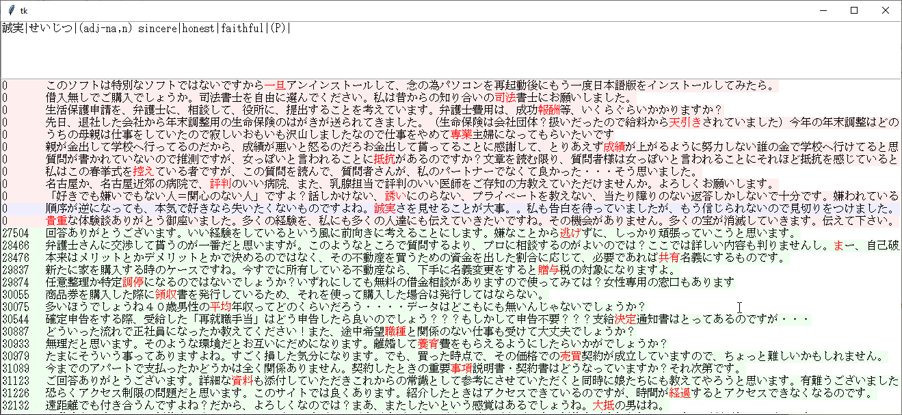
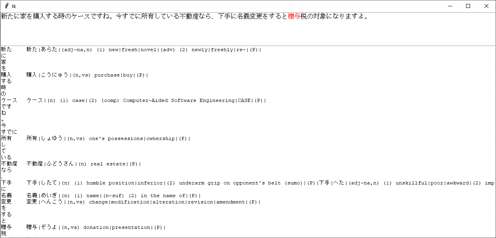

## Optimizing L2 Vocabulary Acquisition Through Machine Learning
### Where "i+1" and masked language models meet

## Abstract

A bottleneck for many subscribed to the "sentence mining" -> Spaced Repetition System (SRS) flashcard paradigm is the manual effort involved in finding high-quality flashcard material.  This work outlines a method for large-scale unsupervised production of high-quality flashcard material from unstructured text.  The method involves training a light-weight masked language model and has been applied, on a small scale (20,000 words), to Japanese social media and English ArXiv papers.  Over 1 million Japanese flashcards demonstrating over 11,000 words (100 examples per word) are freely available for download.  This will be scaled up in a future version.

## Introduction/Overview

### Problem Definition

As an advanced language learner and adherent to the "sentence mining" -> Spaced Repetition System (SRS) flashcard paradigm, I find that new words and phrases I would like to learn often occur in contexts that are not amenable to making flashcards because of insufficient "context clues", making it difficult to recall the meaning of the contextualized word or phrase at quiz time and reducing the overall efficiency of the study process.  To address this lack of strongly contextualized flashcard material, I wrote a script several years ago which was able to scrape 25GB of raw text from Japanese (my L2) social media websites.  This helps because when I find a new word or phrase in native material, I can search this corpus for examples... but this introduces a new challenge.  How does one efficiently evaluate 5,000 - 50,000 examples of a target word to find the ones with the strongest context clues?

### Cloze Deletion and Masked Language Models

I was reading the SpanBERT paper (https://arxiv.org/abs/1907.10529) one day and recalled having read about what the author at the http://www.alljapaneseallthetime.com blog refers to as “Massive-Context Cloze Deletions” or MCDs.  An MCD is a sentence or short paragraph with a single token knocked out and the language learner's task is to "fill in the blank".  It struck me that this is qualitatively equivalent to the way in which state of the art language models like the Transformer-based BERT (https://arxiv.org/abs/1810.04805) are pre-trained.  These so-called Masked Language Models learn contextual embeddings as a result of being trained to "denoise" intentionally corrupted input texts.  When fine-tuned, these pre-trained language models often achieve state-of-the-art results on downstream tasks... and you can see where this is going.  If language models can be trained to "fill in the blank" using context clues, then it should be possible to train one and then use it to rank example sentences by contextual strength.  This should strongly correlate with an L2 learner's ability to recall the meaning of the word at quiz time, leading to a more efficient study process overall.

### My Contribution

A simple language model was trained to "fill in the blank" using text from Japanese social media segmented with the MeCab (https://pypi.org/project/mecab-python3/) morphological analyzer.  This model was trained on over 300 million tokens, representing 20,000 unique words.  Resampling was done to ensure that the most frequently occurring 16,000 words were uniformly sampled.  A perplexity of 105 was achieved on the validation set after fine-tuning.  Over 1 million example contexts are available for download, representing the 100 strongest contexts (according to my language model) of over 11,000 "words" (according to MeCab).

### Key Points:

#### In Principle:
Having a strong language model that can sift through a large body of text looking for the best examples means we basically have a reliable source of high-quality examples for virtually all commonly used words and phrases, which means:
1. We can do "i+1" on steroids because, with so many examples, many will exist where the new word is the only unknown.
2. Because the availability of high-quality "i+1" flashcards is so high, we can divorce the new word from its presentation and display it in a random presentation at test time.  This means the learner is exposed to a wider range of contexts, collocations, and usages.
3. Because the language model can be scaled with the size of the body of text, we can divorce the process of acquiring new vocabulary from the process of immersion, itself... or at least make it voluntary.  This is because a simple frequency list can be used to prioritize new words and because the model can be scaled to learn the usages of many tens of thousands of words, keeping even the most diligent learner busy for years.

#### In Practice:
I've written a simple SRS interface (pictured below) with a very simple scheduling algorithm to test the assumptions laid out above.  Just some basic stuff about the interface:
*	it's one flashcard per line
*	the red word in each line is the target word and is the only thing the user is responsible for knowning
*	the EDICT dictionary entry for the target word, when available, is shown in the top window (I know, bilingual dicts are for n00bs)
*	the red background is for words that are due and the green background are "i+1" words ready for activation

So I've been busy testing my assumptions and I've found that:
1. In general, the examples produced are actually pretty high quality.  I haven't really had any problems with weak contexts.
2. The "i+1" thing is way stronger than I'd expected.  I've only got around 2600 words "known" right now and I've already got over 5000 unique words available in "i+1" contexts, so that's actually a lot better than I was expecting.
3. I'm satisfied that the model can be scaled with more text and I'm very happy with the results I've had so far allowing the SRS to select random "i+1" presentations for me and selecting "i+0" presentations for "known" words when it's time to quiz them.  I'm happy that it'll all scale and to let it do its thing, but...

#### Technical Challenges:
1. Text segmentation.  The model can be as good as you like at learning relationships between tokens, but if the text is not properly tokenized, you'll get situations like I'm seeing in the second image, below.  The tokenization is being done by MeCab and I'm just using the result lazily at present.  The result is that there aren't many words that line up properly with dictionary entries.  Some examples include 司法書士、成功報酬、共有名義、贈与税、and the list goes on.  There are simple words that are not being unconjugated and there are compound words that are being tokenized too far.  I happen to think that MeCab and EDICT are both excellent projects and I could use them together much more effectively than I currently am to try and ensure proper boundaries when segmenting text.  For example, on a character level, I could load the EDICT keywords into a Trie data structure and greedily match patterns.  If I don't find anything, I could check to see if MeCab has resolved that token to an unconjugated/uninflected form that can be looked up.  That could definitely be improved upon, but it would be a large step in the right direction.
2. Definitions.  I'm currently using EDICT.  It's great, and it's got a lot of miles left for an application like this, especially with improvements in text segmentation, but coming up with definitions... I'm open to suggestions.  Seriously.

Ultimately, this is a meaningful step toward the complete automation of the flashcard generation process:<br/>
✓ : Automate evaluation/production of high-context flashcard material<br/>
✗ : Segment text in a way that is optimally meaningful for an L2 learner<br/>
✗ : Have a really comprehensive dictionary<br/>




Other takeaways:
1. I'd like to start a conversation about the role of machine learning in second language acquisition
2. I'd like to crowdsource Japanese text aggregation to scale this up from 20k tokens to, say, 70-80k
3. I'd like to share my ideas on "atomizing" words/grammar/phrases in sentence flashcards
4. I'd like to get ideas and feedback -- especially on tokenizing and definitions
5. You can "take away" around 1.1 million "high-quality" example sentences (according to my language model).  This is composed of the top 100 examples of around 11,000 words representing the 80th to 99th percentile by frequency of the 20,000 word lexicon making up the current dataset (segmented using MeCab).

### Examples:
Examples of strong and weak contexts (according to my model)

Japanese text from social media segmented with MeCab (20k tokens) on a deep stack of iterated dilated convolutional layers

Word:	特許<br/>
Strong:	特許	一般的には発明をしたら最初に __特許__ 出願をして、次にどこかに発表するという手順の方がいいです。最初に発表すると特許が認められなくなります。<br/>
Weak:	特許	立派だと思います。むしろ介護は体力も必要な仕事ですから、男性の介護士は重宝されると思われます。…てか、なんでこの質問が「 __特許__ 」カテゴリ？<br/>

Word:	概念<br/>
Strong:	概念	人間とロボットの関係という __概念__ はあるようですが、ロボット同士の関係はないようですね。人間には人間関係がある。ロボットにはロボット関係がない。<br/>
Weak:	概念	基本的には同じものですが __概念__ が違うようです。ピクセルというのは点１つ分の長さです。つまり、１ピクセル×１ピクセルが１つの点になります。<br/>

Word:	送金<br/>
Strong:	送金	日本からオーストラリアの銀行口座に __送金__ する方法でもっとも手数料が掛からない方法はどうしたら良いでしょうか？<br/>
Weak:	送金	パチンコのほうが許せるかな北朝鮮に __送金__ といってもいまいちピンとこないし。身近で被害を被っているタバコのほうがやめて欲しいです。<br/>

Examples of model preferences for "filling in the blank"

English text from Arxiv papers segmented with BPE (20k tokens) on a shallow stack of BiLSTM layers

	prompt:
		darkweb that are not necessarily observables of the attacks for the organization but we try to measure the extent to which they can perform well over other measures*************this study, there have already been attempts to develop systems at scale that could predict the risk of systems by analyzing various sensors such as binary appearance of log files [8].
	answer:
		. Similar to 
	predictions:
	0.109294474	. According to 
	0.05470071	. For 
	0.038690485	. Unlike 
	0.013808575	. Compared to 
	0.013448008	. Using 
	0.011497075	. On 
	0.00815414	. Based on 
	0.008007415	. Following 
	0.007719114	. In such 
	0.005134958	. From 

	prompt:
		provide a reward function. We present baseline policies trained using reinforcement learning for four different commercial robots in the six environments. We *****************modeling human motion results in better assistance and we compare the performance of different robots. Overall, we show that Assistive Gym is a promising tool for assistive robotics research.
	answer:
		demonstrate that 
	predictions:
	0.09668377	note that 
	0.033988427	found that 
	0.03374812	believe that 
	0.024705352	argue that 
	0.02412532	show how 
	0.02130807	demonstrated that 
	0.017756354	expect 
	0.014219382	know that 
	0.010730732	notice that 
	0.010415988	suggest that 

	prompt:
		means that we need a criterion to know when our test data has covered all plausible situations. Our work not only focuses on a test ending criterion but on a *************testing criterion that lets us evaluate how much of the system's decision space a test suite covers, rather than how much of the possible scenarios have been covered, as different scenarios could lead to the same decisions.
	answer:
		more general 
	predictions:
	0.0029336014	fast 
	0.0024056516	complex 
	0.0022412534	behavioral 
	0.0021178033	powerful 
	0.0020651175	null 
	0.0019631959	strong 
	0.0016073828	consistent 
	0.0015987481	simplified 
	0.0014659748	sparse 
	0.0013874066	secure 

General background on Second Language Acquisition (SLA) and my personal experience learning Japanese:

	Concepts
	
		Input Hypothesis: Your brain is smarter than you and language is about the most human thing there is, so if you get out of your brain's way and give it native material, it'll handle the details and you'll learn the language through seriously huge amounts of input with one caveat...

		Comprehensible Input: The input has to be comprehensible.  The richer the context, the better.  The fewer unknowns, the better.  The logical conclusion is what is referred to as "i+1".  I show up knowing "i" things and then I see a single new piece of information (kanji/word/grammar/phrase/concept/collocation/etc.) and I'm in the maximally efficient environment for acquiring it because I'm learning a single new thing which is, ideally, strongly contextualized by a bunch of other stuff I already know.

		Extensive Reading/Listening: I'm going to read/listen to tons of stuff and whatever sticks, sticks.  I may be inclined to circle a word and come back later, but I'm mainly guessing on the fly.  Extensive practices like these seem more related to picking up nuance and building up semantic representations.  I spend almost all my time doing "extensive" things.

		Intensive Reading/Listening: I'm going to read/listen very carefully and fully understand the input.  I find intensive work to be time-consuming and not particularly enjoyable, so I pretty much only do it when I'm translating something.

		Spaced Repetition: Reading/Listening to native material represents a systematic way in which a learner can encounter new material and the Spaced Repetition System (SRS) is a systematic way of reviewing and maintaining what has been encountered.

	People

		Stephen Krashen: Professor/researcher/linguist.  Probably the most well-known (and first?) proponent of the Input Hypothesis and of Comprehensible Input.  Famously demonstrated the concept of Comprehensible Input decades ago in a video in which he spoke in German to describe a scene.  More recently gave an excellent talk entitled "Trends in Sustained Silent Reading" at the KOTESOL conference (2011) (https://www.youtube.com/watch?v=bJZEx3ibVDA) in which he recalled a study in which the subjects were two groups of school-aged children.  One group was specifically taught grammar and phonetics and the other group was instructed to engage in "sustained silent reading" of whatever they liked.  The sustained silent reading group did better on a grammar evaluation than the group that'd specifically studied grammar.  I'm sure Krashen has done loads of other interesting things, but that old video and the KOTESOL conference are the two things I know him for.

		Antimoon (http://www.antimoon.com/): Polish guys who used the Input Hypothesis and SRS to learn English and then wrote about it in English.  In the Japanese learning community, it seems like these were the guys who kind of proved the concept.

		Ajatt (http://www.alljapaneseallthetime.com/blog/): A guy who writes under the pseudonym Katsumoto (勝元, "the beginning of winning :D") popularized the methods used by the guys at Antimoon and applied them to Japanese.  It was Katsumoto who first lead me down the rabbithole of massive input and SRS.

		MATTvsJapan (https://www.youtube.com/user/MATTvsJapan/videos): A guy who reached a high level using the Ajatt method and who works with a friend of his (Yoga?) to make his own contributions through his YouTube channel and through projects like MorphMan; a project that primarily exists to reorder an existing body of flashcards to optimize the learner's exposure to new morphemes based on number of unknowns and morpheme frequency or user-specified priority -- I think... I might be wrong about that.

		To my knowledge, while a lot of work has been done with regard to methods, nobody has really focused on the bottleneck that is the manual effort involved in determining what constitutes a good presentation of a new word/phrase/concept/etc.  While I am of the opinion that making your own flashcards from stuff you've read is the most effective/rewarding way of doing flashcards, I also recognize that there's a huge cost involved in doing that.  I spent a few years of 2-3 hours/day on flashcards and it paid off, but I'm never going to put in that kind of time again... at the same time, I like the idea of studying again, so my focus has been on methods and making them more efficient.  I happen to be a software engineer with experience in machine learning and natural language processing, so this is really right up my alley.  But before I get to the juicy part (the methods :D), I'll drone on for a while about my personal experience with Japanese, but you can follow the neat indentation and just skip that whole section ;)

	My Learning Experience (Japanese)

		I got into Japanese for social reasons.  Best friend was into it in high school.  Lots of Japanese nationals in my university/soccer team/dorms/etc, so I had plenty of opportunity to be influenced and impressed and decided to learn the language.

		Undergrad: I had the typical experience.  I took Japanese at a university level for 3 years and made A's and B's all 6 semesters.  It doesn't count, though, because I remember listening to a song by BoA toward the end of those three years and not only could I not understand the lyrics... I couldn't tell if she was singing in Korean or Japanese!  I couldn't tell if this language was one I'd never heard before or if it was the one I'd been studying for 3 years at a university level.  That literally happened.

		Ajatt: A friend (who was also studying Japanese) tells me about Ajatt.  In a few days, I consume the entire blog.  It all sounds plausible.  I'm amped!  I write my own SRS because I'm hard-headed like that, and I get busy with Remembering The Kanji and I strip-mine All About Particles.

		Manga: Having mined RTK and All About Particles, I'm familiar with the meanings and appearances of a few thousand kanji and I have a base of probably 1000-2000 vocab, so to learn how to actually read the kanji, I read manga for a year - FMA, 進撃の巨人, Dragonball, Trigun, Claymore, etc. bunch of stuff.  I also read blogs like grapee.jp.  The big idea was that manga have furigana and the browser has plugins like rikaichan and yomichan that help with looking things up.  So I make flashcards and I'm off to the races.

		Novels: After reading manga/websites for about a year, I get straight into novels for a few more years... mostly translated stuff like Harry Potter, Ender's Game, Hunger Games, etc. and a probably half a dozen natively Japanese titles.  I did a brief stint in light novels, but they're not easier.  They're too fantastical and unrelatable.  Speaking of relatability, that's the purpose for having started with translated stuff I was familiar with from English.  Much better at guessing and if I get lost, I can just skip that part without worrying about missing something important.

		Translation: I actually got around to translating chemical journal articles and patents for my research group.  My BS/MS/PhD are in chemistry/toxicology/materials :P, so there was lots of opportunity because labmates would find publications they couldn't read.  I ended up registered with an international translation firm for about a year before I started work as a software engineer.

		In the end, my dissertation and the subsequent job hunt really distracted from my language study.  I'm only just getting back into it and I have to say my priorities have shifted.  I still like language learning and I'll continue doing it, but I'll never spend 2,3,4 hours a day doing it again.  However, if I can build a little app on my phone where I can rep while I'm on the can or while I've got some down time, I'd really like that.  Further to that point, the thing that really animated this whole process was the realization that I already have just a few tons of Japanese text and that I might be able to train a language model to sift through all that text and present to me all the best examples of whatever I want!  This is because modern language models are often evaluated using a metric called Perplexity which is literally just "how good is this model at predicting a missing word" whether that word is the next word in a sequence or some masked word in the middle of a text hardly matters.  That, and I'm a language nerd who just likes building things and collaborating with other language nerds, so let's build something!  I'll start by telling you what I've done so far.

Methods/Results:

	Step 1: Build a corpus ;)

		You're going to want lots of text to train your language model.  I have around 7GB of raw text after cleaning up the initial 25GB which has translated to around 315 million tokens after resampling based on the 20,000 words I chose for my lexicon, but "real" language models train on vastly larger datasets... on the order of 10s-100s of billions of tokens (see Meena https://arxiv.org/abs/2001.09977 or GPT-3 https://arxiv.org/abs/2005.14165).

	Step 2: Text Segmentation

		2a) Character-Level Segmentation

			This involves handling text as a sequence of characters.

			Pros:
				- It's easy to implement.  You don't need any tools or preparation.
				- You can represent everything, so you don't have to worry about "out of vocabulary" tokens.
				- Language-agnostic.  This segmentation method doesn't know or care what language it's dealing with.

			Cons:
				- Characters, on their own, typically contain low information content compared with other segmentation methods, so it's harder to know how many concepts you're introducing in text and to uniformly sample them when training a language model.  I know that character level models perform well in PoS tagging, NER, and even in neural machine translation (ByteNet https://arxiv.org/abs/1610.10099), but I'm building a language model for a specific purpose and, honestly, I tried training a character level gap-filling model, but it didn't work as well for reconstructing multi-character spans and I didn't want to have to mess with using a Viterbi decoder to figure out what the predicted token was going to be.  It's way easier to just have a single gap and a softmax/argmax.

		2b) Byte-Pair Encoding

			Byte-Pair Encoding (BPE) was first used for learning tokens for NLP in 2015 for a neural machine translation task (https://arxiv.org/abs/1508.07909) and was further popularized in the GPT-2 paper (https://openai.com/blog/better-language-models/).  BPE is a simple algorithm that builds up statistically significant patterns one merge at a time.  These statistically significant patterns are also linguistically significant and can work at the byte level or at the character level, which isn't always the same thing (https://arxiv.org/abs/1909.03341).

			Pros:
				- Learned tokens are highly entropic compared with character-level representations.  This is intuitive and is evidenced by the much lower perplexities that can be achieved per-token for character-level models.
				- The number of tokens to be learned can be specificied.
				- Learned sub-word units can help reduce "out of vocabulary" tokens, compared with word-level models.
				- Language agnosticism.  Again, BPE doesn't care what language it's encoding.

			Cons:
				- It can be time/memory consuming to perform on very large corpuses
				- It introduces the possibility of "out of vocabulary" tokens, compared with character-level models.
				- Learned tokens almost never segment text in a way that lends to dictionary look-up.  This is a problem for my application.

		2c) Rule-Based Segmentation

			Morphological analyzers like MeCab, in the case of Japanese, are typically developed in academia and are based on dictionaries and sets of rules.  These custom tools provide the most information about morphology, conjugation, part of speech, etc., and provide results that will usually appear in a dictionary.  In the case of Japanese, MeCab dovetails nicely with Jim Breen's EDICT project (http://nihongo.monash.edu/cgi-bin/wwwjdic?1C).

			Pros:
				- Provides lots of information about tokens
				- Segments along grammatically meaningful boundaries
				- Tokens can be easily counted and are amenable to dictionary lookup

			Cons:
				- Language dependence.
				- I personally like BPE better ;) but I really appreciate being able to look things up!
		
		2d) Custom

			For example, I use regex and stuff when I'm tokenizing English and it works fine.

		There are other methods for segmenting text, for example, WordPieces and stuff, but who cares?  It's basically fancy BPE and I'm going to pull my engineer card and say BPE is "good enough".

	Step 3: Train a Masked Language Model

		Depending on the language and application, a pre-trained language model may be available.  The devs over at Huggingface (https://huggingface.co/), for instance, have reimplemented and pre-trained a number of cutting-edge language models.  In this case, I decided to "roll my own" because it's useful self-study and because the task of estimating relative contextual strength is more forgiving than some other tasks in NLP.

		3a) Model Design

			The stated goal here is to build a model that, when conditioned on the context surrounding a masked token, can predict the value of the masked token with an acceptable degree of accuracy.  Andrej Karpathy wrote an iconic blog entry about the effectiveness of RNNs in language modeling (http://karpathy.github.io/2015/05/21/rnn-effectiveness/) and ELMo (https://arxiv.org/abs/1802.05365) is a recent example of the effectiveness of bidirectional recurrent-type layers in encoding relative positional information, which produces rich contextual embeddings that are great for downstream tasks and would be ideal for this task... but recurrent layers are slow at training and inference and I don't feel like waiting that long and, honestly, I haven't bothered to figure out self-attention well enough to implement a self-attentive model, so I'm using a convolutional network.  Besides, if you look sideways and squint a little, convolutions are also sort of doing the job of BiRNN and self-attentive models in the sense that they encode information about relative position, they have bidirectional receptive fields, and are basically using fixed attention within that receptive field.

			Building a model with the Keras functional API

			```{python}
			from keras.models import Model
			from keras.layers import Input, Embedding, Dense, Conv1D
			from keras.layers import Add, BatchNormalization, Activation
			from keras.layers import GlobalMaxPooling1D, Multiply
			from keras.initializers import RandomNormal

			def build_model(dimms, kernel_size, dilations):

				inputs = Input(shape=(input_size,))
				embeddings = Embedding(len(charmap), dimms, input_length=input_size)(inputs)

				position = Input(shape=(input_size,1))
				
				x = embeddings
				for dr in dilations:
					y = Conv1D(filters=dimms, kernel_size=kernel_size, dilation_rate=dr, padding='same', kernel_initializer=RandomNormal(0,0.01))(x)
					y = BatchNormalization()(y)
					y = Activation('relu')(y)
					x = Add()([x,y])

				z = Multiply()([x, position])
				
				z = GlobalMaxPooling1D()(z)

				outputs = Dense(len(charmap), activation='softmax')(z)
				model = Model([inputs, position], outputs)
				model.compile(loss='sparse_categorical_crossentropy',optimizer='adadelta',metrics=['accuracy'])
				model.summary()

				return model

			for e in range(epochs):
				features, positions, labels = generate_dataset(samples, comments, input_size, fmap, train_range, resample_frequency)
				model.fit([features, positions],labels,batch_size=256,epochs=1,verbose=1)
			```

			Above is the general architecture I've learned to like from other projects.  The stack of 1D convolutions is pretty good for lots of NLP tasks.  The ReLU activation function is pretty much standard for anything with more than a few layers, I'm pretty sure I picked up the kernel_initializer, the BatchNormalization, and the ResNet-style residual connections from the AlphaGoZero paper (https://www.nature.com/articles/nature24270).  The idea of using iterated dilated convolutions came from the work of Strubell et al. 2017 (https://arxiv.org/abs/1702.02098) and from Kalchbrenner et al. 2016 (https://arxiv.org/abs/1610.10099).  I have actually used the TimeDistributed layer wrapper for this sort of sequential output, but in the interest of reducing memory requirements, I've opted to just tell the model where the masked token is with a one-hot array and to extract that position with Multiply() and GlobalMaxPooling1D() layers.  This also speeds things up quite a lot because doing softmax on 20,000 dimensional outputs is expensive so it's better to it once instead of "input_size" times.  The sparse_categorical_crossentropy also helps save memory when creating datasets as they don't get expanded until the batch is created... let's see... the Embedding layer is a big reason why this step is language-agnostic.  You'd need to find embeddings or create your own by doing PCA on a co-occurrence matrix or training a model like word2vec, but in this case, it's possible to just tack on a layer that learns embeddings of a specified dimensionality during training, so it's basically a TimeDistributed Dense layer.  I still use Adam for fine-tuning, but I've come to like AdaDelta for general training... and there's a neat paper by Smith et al. at Google Brain (https://arxiv.org/abs/1711.00489) showing that increasing the batch size is an effective way to fine-tune.

			I know that dropout is a good regularizer.  I felt like I had enough data to train on to not need it in this case.  However, if I'd felt the need to use dropout, I'd have used SpatialDropout1D right after the Embedding layer and called it a day.

			The open questions at this point are to figure out how the model performs as number of filters, number of layers, and rates of dilation are varied.

			Experiments

			Testing is required to narrow in on a suitable CNN architecture, so the scaled-down problem of predicting a missing character out of the most common 3000 Japanese characters was used to deciding what architecture to scale up for the problem of predicting a missing word out of 20,000 words.  Characters were resampled to ensure the most frequent 2400 characters (80%) were uniformly sampled.  Kernel size was fixed at 3 and the number of kernels, d, and the dilation rate, dr, and the number of layers were varied.

			
			
			Figure 1: AUC and Perplexity on a character level prediction task

			Starting with 100d and undilated convolutions and varying the depth of the convolutional stack from 3 to 5 layers, we can see that there is almost no benefit to AUC or perplexity.  The large improvement obtained from increasing the dimensionality to 200d suggests that, while 100d and even 50d (according to some publication I can't remember) are fine for embedding sizes, 100d is too small to capture a rich context in the convolutional stack, itself.  Attempting to increase the receptive field of the undilated convolutions by going from 5 layers to 10 (in green) results in classic signs of overfitting, evidenced by poorer AUC and perplexity on the validation set as training continues.  Iterated dilations were tried in an effort to increase the receptive field without overfitting.  It worked pretty well, but I didn't let the IDCNN train long enough to demonstrate either that it wouldn't overfit or that it ultimately achieves better perplexity than the undilated 5 layer convolutional stack, but it does learn much more quickly, so I decided to move to fine-tuning.  The point at which fine-tuning begins is pretty obvious by the sudden improvement around 125 epochs on the maroon colored data.  Fine-tuning was done using Adam(lr=0.0001) and by increasing the batch size to 1024.

			Convolutional stacks are actually pretty fast to train and Strubell et al. showed that they are also competitive with BiLSTM stacks on named entity recognition tasks (https://arxiv.org/abs/1702.02098).  In the same work, they note that the use of iterated dilated convolutions increases the receptive field of a convolutional stack exponentially with depth as opposed to linearly as in the case of standard convolutions.  A simple spreadsheet can help understand why this is the case.

			 
			

			The top image is from the Strubell paper and illustrates what it means to iterate dilations.  The bottom image shows the receptive fields of different networks, each with a kernel size of 3, but varying the number of layers and the dilation rates.  The idea of repeating a stack of dilation rates comes from the ByteNet paper and I like it because the four-layer IDCNN has an attention profile that appears to have "blind spots", whereas the eight-layer IDCNN has a much smoother attention profile across its receptive field.  That just seems nicer to me and I went with the eight-layer IDCNN for the scaled-up model.

			

			Yay!  We have a decent looking model!  After training and fine-tuning, a perplexity of 105 was achieved on a dataset with 20,000 words in which 16,000 of them were uniformly sampled.  Not bad :)

		3b) Resampling Source Text

			I'd scraped enough text to make a useful "bench-scale" model with 20,000 tokens, so I didn't need to resort to using "out of vocabulary" tokens.  It would have been kind of tricky, anyway, since I'm using an embedding layer.  I guess I could have reserved like 1000 tokens and randomly sprinkled them in to replace oov tokens and just avoided sampling them for prediction, but that's a story for another day.

			I started by using MeCab to segment roughly 13 million comments to build a frequency list of tokens.  Next, I decided 20k is a large enough number to be useful and a small enough number that it would be appropriate for my dataset.  I then resampled the comments such that only those 20k tokens are represented, leaving me with around 5 million comments for training.

			The comments themselves are aligned in a linear array, delimited by '[SEG]' tokens.  An int16 numpy array and corresponding key:token:counts lookup table are saved as an intermediate for quick access.

		3c) Resampling During Training

			The frequency of use of words in a language decays exponentially.  This is known as Zipf's Law.  This is important to understand because machine learning algorithms are little cheaters and if you give them a shortcut, they'll take it.  In this case, that means if you randomly sample words to mask, your model can learn to use the most frequent 500 words and get 80% accuracy and just ignore the other 19,500.  A little hyperbolic, but I've found that resampling is important, so when I build my training data, I draw a random number and compare it with the frequency distribution to decide whether I should resample.  In this way, I ensure that, in this case, the most frequent 80% of words get sampled uniformly and Zipf's law takes over for the remaining 20%.  I end up uniformly sampling 16,000 words in this case and that has produced good results for me.

			A corollary of Zipf's law is that if we want to get good representative use cases of uncommon words at ranks like 50k-60k, orders of magnitude more text is required.

	Step 4: How can this model be used?

		4a) Ranking Flashcards by Contextual Strength

			The most immediate use of a model trained to fill in the blank is to rank contexts by likelihood.  In practice, if I wanted to rank contexts for the word "job", I would go to my dataset and collect every comment that contains the word "job", replace the word "job" with a '[MASK]' token, and then ask the model to predict the missing word.  We already know the word is "job", so we just check the likelihood corresponding to the word "job" and that's our score for contextual strength.  The higher the predicted likelihood of the correct word, the stronger the context.

			Applications:

				The way flashcard decks are made seems to be manual at the moment.  Someone goes out and manually curates example sentences and makes a public deck or, in my case, I read novels or something and try to find good contexts in the wild.  In any case, it seems like the way this is currently done involves a lot of manual effort.  This limits the number of flashcards available and, therefore, the number of contexts in which a word can be seen while reviewing flashcards -- typically, a word will be the target of either a single flashcard or a small number of flashcards.

				The process of collecting utterances from social media can be automated.  This means, in principle, we can have as many examples as we want for virtually any word or phrase we're likely to care about.  These examples will naturally vary in quality, but it would take a monstrous effort to sort them all out.  A well-trained model could sort them out for us and this might constitute a shift in how people review flashcards.  For example, instead of having 1 or 2 flashcards to demonstrate a word or phrase, why not have 100?  While we're at it, since we can have reasonable confidence that the model is able to present us with high quality flashcards, why not use the SRS algorithm to keep track of individual words or phrases and randomly select a high quality example when it comes time to review that word or phrase again?

				This would do a few things:

					1) It would enable learners to see a larger number of natural contexts for words of interest instead of memorizing one or two.

					2) i+1 on steroids.  It's commonly accepted that the most efficient way to pick up new concepts is one at a time.  If an L2 learner knows "i" concepts, then he/she will benefit most from seeing a flashcard that represents i+1 concepts.  The YouTuber MattVsJapan (https://www.youtube.com/user/MATTvsJapan/videos) is involved with (created?) the MorphMan project which is meant to reorder flashcards to enforce this very constraint.  If 100+ high quality examples are available for each of tens of thousands of words/phrases in the target language, then a flashcard review program could dynamically build a "whitelist" of the terms appearing in mature flashcards, search through a few million flashcards (100 for each of 10k+ words) for ones meeting the "i+1" criterion, then show them in an order that enables the learner to review words that are due before preferentially filling in the highest frequency gaps in the learner's knowledge, for example.  Lots of options become available.

					3) Enable indefinite scaling, in principle.  Flashcards should be part of a balanced diet.  Learners should obviously be doing plenty of reading, listening, and socializing in their target language and a tool like this could help facilitate that by compartmentalizing the process of finding and acquiring vocabulary, thereby making it voluntary/unnecessary to actively search for new vocabulary and freeing the learner up to engage in more enjoyable language related activities.

		4b) Selecting Distractors

			In multiple choice questions, distractors are the other answers that are meant to sound plausible and distract you from the answer.  The test-taker is then meant to be discerning enough to tell the difference and select the right answer anyway.  Some work has been done on distractor generation (https://arxiv.org/abs/2004.09853) and there are basically two pretty straightforward ways of attempting distractor generation in this case.

			4b1) Using the trained model, itself. A pretty sweet bonus of having trained a language model is that we can use the same language model to produce a high-quality set of distractors.  This leverages the fact that the language model is relying on having learned embeddings at the input layer and on having generated contextual embeddings right before the classification layer.  Those contextual embeddings, as mentioned in reference to the ELMo and BERT models, are there to map onto an expected value, but the values aren't one-hot.  These input and output level embedding layers are basically doing dimensionality reduction, which is kind of also the same thing as lossy compression.  This is achieved, in this case, by grouping things in a vector space on the basis of semantic similarity, which means that, instead of merely asking the model for the argmax of the predicted value, we should be able to take, say, the top 10 or 20 predictions and they should be plausible candidates for the fill in the blank problem.  In other words, they'll probably make good distractors, which allows this to be used in two modes: recognition mode and multiple-choice mode.

			The following is an admittedly cherry-picked example, but it demonstrates the plausibility of the approach.  The answer itself is a day of the week and the distractors are other days of the week, holidays, times of day, and months of the year... so they're all time-related, and could be randomly sampled at quiz time to build a novel set of multiple choice answers.  The second example is actually pretty entertaining, lol... the model seems to think this person is hanging out in some questionable joints :D

			Note: Japanese text doesn't have spaces and I don't endorse using spaces in flashcards.  The following is a tokenized view to show how the model sees the text and to facilitate identification of i+1 cards by already having the flashcard tokenized.  It's pretty much copy/pasted from the million+ examples file I uploaded (with minimal editing).

			Answer: 土曜日
			Question: [SEG] 今週 の 日曜日 と 言っ たら １ ７ 日 です ね 。 建前 から 言っ たら 一 週 は 日曜日 から 始まる こと に なっ て い ます が 、 最近 で は ビジネス 手帳 を 中心 に カレンダー の 多く が 、 週 は 月曜日 から 始まっ て [MASK] ・ 日曜日 で 終わる 表記 の もの が 主流 です 。 [SEG] [SEG]
			Distractors:
			土曜日 0.3185852 土 0.11403965 土曜 0.07522853 祝日 0.05303336 月曜日 0.049625997 あさって 0.029116696
			月曜 0.025645258 火曜日 0.016687687 夕方 0.016655127 １１月 0.015224018

			Answer: 居酒屋
			Question: [SEG] 私 が 働い て い た スポーツ ジム は 結構 、 みんな 仲良く て 飲み 会 とか ２ ヶ月 に １ 回 くらい で やっ て まし た よ 。 でも １ 番 出会い が 多い の は 居酒屋 だ と 思い ます 。 私 の 周り は [MASK] の バイト で 知り合っ た 彼氏 が 多かっ た ので 。 [SEG] [SEG] [SEG]	
			Distractors:
			スナック 0.25561944 飲み屋 0.1136522 サクラ 0.053267717 居酒屋 0.045296103 スタバ 0.035692472 キャバクラ 0.031131526 水商売 0.0271534 酒屋 0.024966074 ファミレス 0.017192462 ゲームセンター 0.014619579

			4b2) A second method for generating distractors would be to generate embeddings with a cooccurrence matrix/PCA and randomly sample nearest neighbors or something, but that would just mean sampling static vectors and would be less context-appropriate than using the model.

			Applications:

				The ability to generate plausible distractors gives learners a more active option for testing recall.  My flashcards are typically passive.  I look at a block of text and decide whether I could read/understand it and self-evaluate, but all of the information is present and known to me all the time, so the recall itself is less active.  In the case of multiple choice, I would need to use context clues to eliminate some options and support others and, in that way, I'm more engaged in the review process and should be more strongly impressed as a result (literally me just conjecturing now).

				So the learner could switch between passive and active quiz modes.  A technical consideration would be that in multiple choice mode, the learner isn't technically trying to guess "the right answer".  Instead, the learner would be trying to guess what the author originally wrote which I'm explicitly assuming is highly correlated with what is "correct".  Another technical consideration becomes apparent with pretty much all of the examples.  The model has produced answers that are so plausible they can't objectively be distinguished.  So things like these would need to be addressed before using multiple choice mode with confidence.
	
	Step 5: Notes and Future Work

		*	This isn't really suitable for complete beginners.  In order for the "i+1" stuff to really do its magic, you should ideally know a few thousand words.  That'd put you at least in the intermediate range.  The big appeal here is that this method will be useful for advanced learners, too, and while the tokenization and dictionary stuff aren't completely sorted out yet, they're still quite useful even in their current form, so an advanced learner could just modify the code to only show flashcards when dictionary entries are available and use it that way.

		*	Assuming the tokenization and dictionary lookup get sorted out, the human would effectively have been removed from the process of finding and creating flashcards and that'd shave off probably 90-95% of the manual effort involved in repping SRS.

		*	You can "atomize" your flashcards.  If the learner is only responsible for a single piece of information per flashcard, this greatly simplifies things.  The user no longer has to worry about forgetting other words that are incidental passengers on this flashcard and, at the same time, since the user is only tracking token performance and is looking up random "i+0" presentations at quiz-time for known tokens, it's now possible to have multiple sentence packs as drop-in replacements.  This can accommodate changes in themes (it's Harry Potter week?) and it can accommodate improvements in the machine learning algorithm without losing progress on known tokens.

		*	MattVsJapan on Youtube talks about priority lists with his/Yoga's MorphMan plugin to the popular Anki SRS program.  Such priority lists can be applied here as well, or the user can just learn things in order of frequency, or the user can just run away with some nice example sentences and do whatever he/she likes with them.

		*	In order to define a starting off point, the user can specify a percentile and assert that he/she knows k% of the language by frequency and can start by studying material above that threshold or the user can supply a tokenized novel or blog or any other body of text and say "I can read all of this" to establish a baseline upon which the "i+1" recommendation algorithm can begin to work.

		*	With a method like this, I'm basically reminded of the OpenAI paper Language Models are Unsupervised Multitask Learners linked at their github (https://github.com/openai/gpt-2).  In this sense, if a language model is supplied with, say, a biology textbook, then a user could generate semantic embeddings/use knn and make some fill in the blank study material with a language model like this!  For that, I'd probably find a pre-trained LM.  They're typically pre-trained on stuff like Wikipedia anyway :)

Post...face?

	If you think it's a cool project, drop me a line.  If you have ideas or errata, drop me a line.  If you'd like to contribute some code or help me scale this up or develop an open source app or something, then also get in touch.


